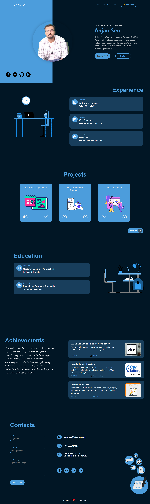

🚀 Portfolio Website - Anjan Sen

Welcome to my portfolio website! This is a showcase of my projects, experiences, achievements, and skills as a Frontend and UI/UX Developer.

## 🌟 Features
- **Responsive Design** - Fully optimized for desktop, tablet, and mobile devices.
- **Light/Dark Mode** - Seamlessly switch between themes.
- **Interactive UI** - Built with a sleek and engaging user interface.
- **Smooth Navigation** - Hamburger menu with overlay for mobile users.
- **Contact Form** - Simple and accessible form to get in touch.

## 🛠️ Tech Stack
- **HTML** - Structured and semantic markup.
- **CSS** - Modern styling with animations and transitions.
- **JavaScript** - Interactive components and functionalities.

## 📸 Preview


## ⚡ How to Run
1. Clone the repository:
    ```bash
    git clone https://github.com/anjansen/portfolio-website.git
    ```
2. Navigate to the project folder:
    ```bash
    cd portfolio-website
    ```
3. Open the `index.html` file in your browser.

## 🌑 Toggle Light/Dark Mode
- Click the **Dark Mode** button on the header to switch themes.
- Theme preference is stored using `localStorage` for persistence.

## 📬 Contact
Feel free to reach out!
- Email: anjansen30@gmail.com
- LinkedIn: [linkedin.com/in/anjansen-tech/](https://www.linkedin.com/in/anjansen-tech/)

## 🧡 Credits
Made with ❤️ by **Anjan Sen**

## ⭐ Show Your Support
If you like this project, please consider giving it a star ⭐ and sharing it!

---
© 2025 Anjan Sen. All rights reserved.

